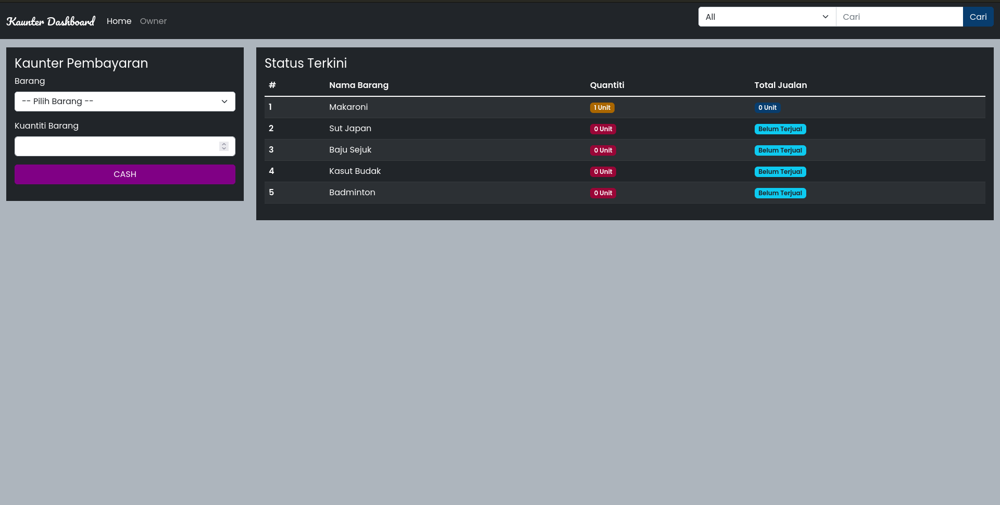
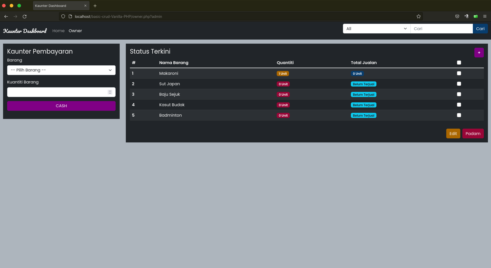
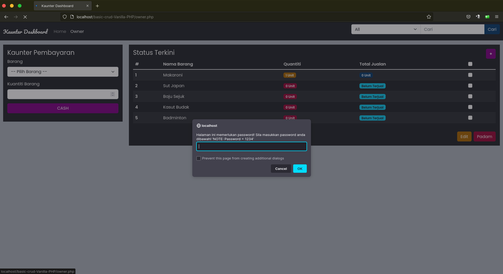
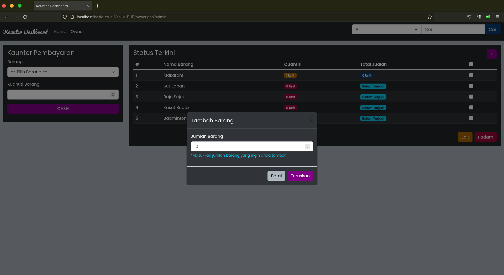
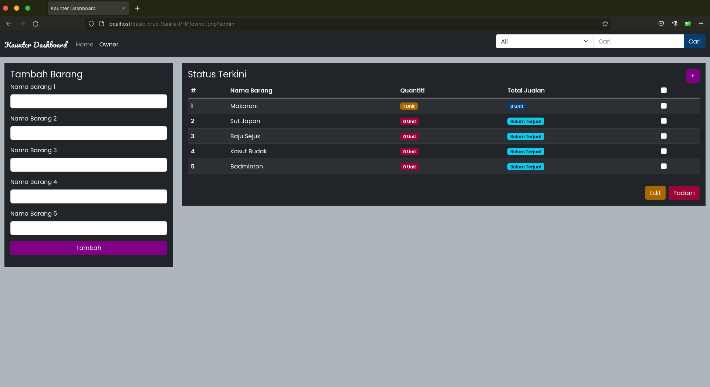
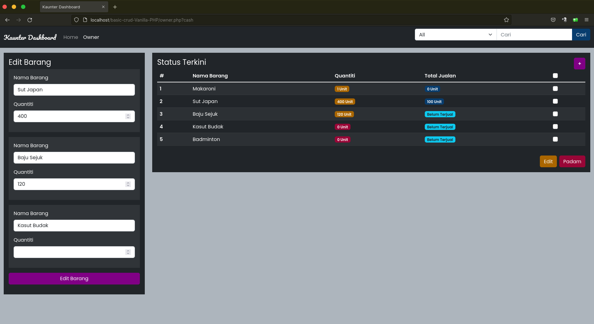

# Basic Crud Vanilla PHP 
Project ini dibina atas dasar percubaan dan pembelajaran sahaja, 
jika anda ingin gunakan secara live, anda perlu tingkatkan securiti pada project ini terlebih dahulu, 
pihak kami tidak akan bertanggung jawab atas apa yang berlaku pada website anda 

## Gambaran Project
Project ini digambarkan sebagai sistem Kaunter Pembayaran `(Casher)` dan Pemilik kedai, halaman `index` adalah casher dan `Owner` adalah pemilik kedai

## Ciri-ciri  
- Tambah data  
- Edit data  
- Padam Data
- Cari Data (Search)
- Css (Bootstrap 5)

## Basic Role
- Public = Penjaga Kaunter
- Owner = Pemilik Kedai

**Public** hanya boleh tolak quantiti barang(di kaunter)

**Owner** boleh :
- Tambah Barang `(Multiple Data)`
- Edit Barang `(Multiple Data)`
- Padam Barang `(Multiple Data)`

## Langkah Menjalankan project
Anda perlu clone project ini dengan salah satu langkah dibawah
```
 //jika menggunakan http
git clone https://gitlab.com/azrilsyamin/basic-crud-Vanilla-PHP.git

//jika menggunakan SSH
git clone git@gitlab.com:azrilsyamin/basic-crud-Vanilla-PHP.git
```

copy file `conf.txt` kepada `conf.php`
```
//jika anda menggunakan terminal 
cp conf.txt conf.php
```
kemudian isi detail host anda pada file `conf.php`
```
// rename or copy this file to conf.php 
$host = ""; //localhost
$user = ""; //root
$pass = ""; //password
$db_name = ""; //database name
```
jangan lupa create database dan table, anda boleh juga jalankan perintah dibawah
```
perintah create db dan table
```

## Preview Public 
  

## Preview Owner
  
#### Owner Password - Memerlukan password untuk ke halaman owner
  

#### Owner Tambah Barang
  

  

#### Owner Edit Barang
 


