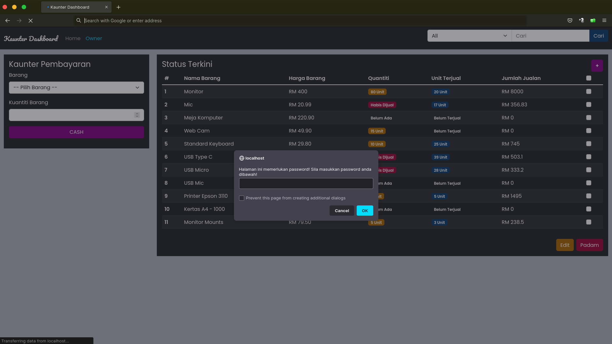

# Basic Crud Vanilla PHP 
Project ini dibina atas dasar percubaan dan pembelajaran sahaja, 
jika anda ingin gunakan secara live, anda perlu tingkatkan securiti pada project ini terlebih dahulu, 
pihak kami tidak akan bertanggung jawab atas apa yang berlaku pada website anda 

## Gambaran Project
Project ini digambarkan sebagai sistem Kaunter Pembayaran `(Casher)` dan Pemilik kedai, halaman `index` adalah casher dan `Owner` adalah pemilik kedai

 
# Table of contents  
1. [Tech Stack](#tech-stack)  
2. [Ciri-ciri ](#ciri-ciri)  
3. [Basic Role](#basic-role)  
4. [Langkah Menjalankan project](#langkah-menjalankan-project)
5. [Preview Public](#preview-public)
6. [Preview Owner](#preview-owner)

 
## Tech Stack    
- CSS - Bootstrap 5 
- PHP
- MySQL
- Javascript + JQuery

## Ciri-ciri  
- Tambah data  
- Edit data  
- Padam Data
- Cari Data (Search)

## Basic Role
- Public = Penjaga Kaunter
- Owner = Pemilik Kedai

**Public** hanya boleh tolak quantiti barang(di kaunter)

**Owner** boleh :
- Tambah Barang **(Multiple Data)**
- Edit Barang **(Multiple Data)**
- Padam Barang **(Multiple Data)**

password untuk halaman owner adalah `Owner`

## Langkah Menjalankan project
Anda perlu clone project ini dengan salah satu langkah dibawah
```
//jika menggunakan http
git clone https://gitlab.com/azrilsyamin/basic-crud-Vanilla-PHP.git

//jika menggunakan SSH
git clone git@gitlab.com:azrilsyamin/basic-crud-Vanilla-PHP.git
```

copy file `conf.txt` kepada `conf.php`
```
//jika anda menggunakan terminal 
cp conf.txt conf.php
```
kemudian isi detail host anda pada file `conf.php`
```
$host = ""; //localhost
$user = ""; //root
$pass = ""; //password
$db_name = ""; //database name
```
Setelah selesai semua langkah diatas, 
anda boleh buka melalui Browser, 
**Database** dan **Table** akan dibuat secara auto selepas anda jalankan project ini di browser

## Preview Public 
  

## Preview Owner
Halaman Owner sedikit berbeza dengan adanya beberapa button tambahan untuk kegunaan owner
#### Owner Password - Memerlukan password untuk ke halaman owner
  
  

#### Owner Tambah Barang
  

  

#### Owner Edit Barang
 


